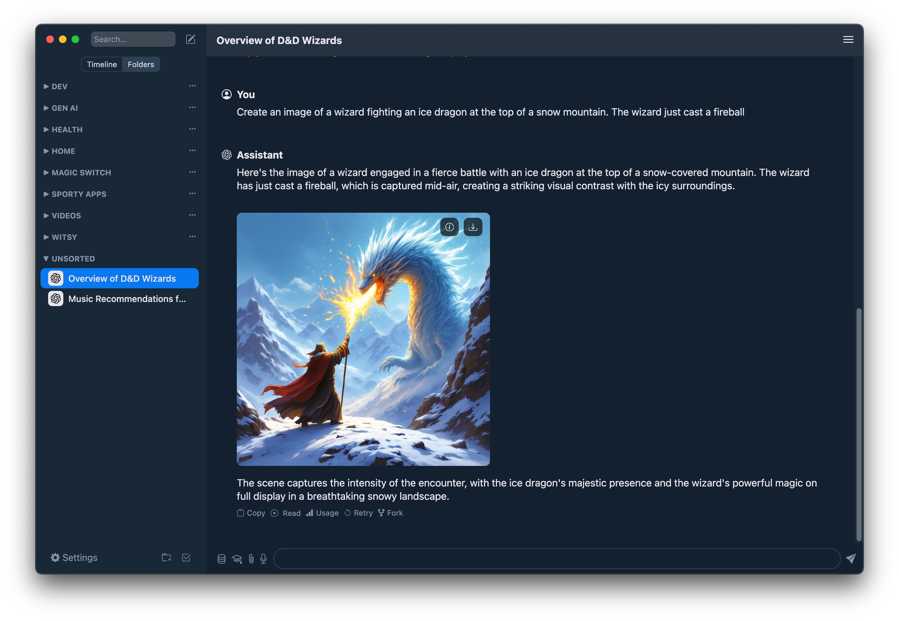
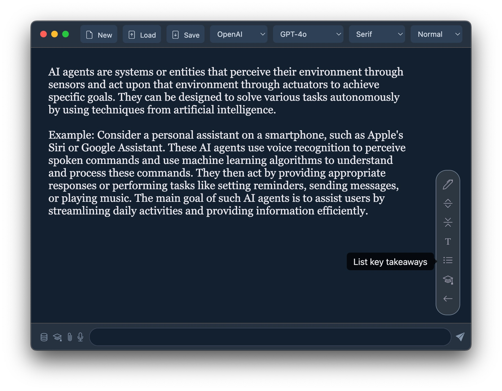

# Witsy AI Chocolatey Package

<div align="center">
  <a href="https://github.com/MKAbuMattar/witsy-chocolatey-package">
    
  </a>
  <!-- <a href="https://community.chocolatey.org/packages/witsy">
    
  </a>
  <a href="https://github.com/MKAbuMattar/witsy-chocolatey-package/releases">
    
  </a> -->
  <a href="https://github.com/MKAbuMattar/witsy-chocolatey-package/stargazers">
    
  </a>
  <a href="https://github.com/MKAbuMattar/witsy-chocolatey-package/forks">
    
  </a>
  <a href="https://github.com/MKAbuMattar/witsy-chocolatey-package/issues">
    
  </a>
  <a href="LICENSE">
    
  </a>
</div>

## Downloads

To install Witsy, run the following command from the command line or from PowerShell:

```powershell
choco install witsy
```

This command will download the witsy installer from the official website and execute it silently.

## Manual Installation

To install Witsy manually, download Witsy from [witsyai.com](https://witsyai.com) or from the [releases](https://github.com/nbonamy/witsy/releases) page.

## What is Witsy?

This package automates the installation of the Witsy application. Witsy is a BYOK (Bring Your Own Keys) AI application: it means you need to have API keys for the LLM providers you want to use. Alternatively, you can use [Ollama](https://ollama.com/) to run models locally on your machine for free and use them in Witsy.

Non-exhaustive feature list:

- OpenAI, Ollama, Anthropic, MistralAI, Google, xAI, OpenRouter, DeepSeek, Groq and Cerebras models supported
- Connect other providers (together, siliconflow, fireworks...) through OpenAI compatibility layer
- Chat completion with vision models support (describe an image)
- Text-to-image and text-to video with OpenAI, HuggingFace and Replicate
- Scratchpad to interactively create the best content with any model!
- Prompt anywhere allows to generate content directly in any application
- AI commands runnable on highlighted text in almost any application
- Experts prompts to specialize your bot on a specific topic
- LLM plugins to augment LLM: execute python code, search the Internet...
- Long-term memory plugin to increase relevance of LLM answers
- Read aloud of assistant messages (requires OpenAI or ElevenLabs API key)
- Read aloud of any text in other applications (requires OpenAI or ElevenLabs API key)
- Chat with your local files and documents (RAG)
- Transcription/Dictation (Speech-to-Text)
- Realtime Chat aka Voice Mode
- Anthropic Computer Use support
- Local history of conversations (with automatic titles)
- Formatting and copy to clipboard of generated code
- Conversation PDF export
- Image copy and download

<p align="center">
  &nbsp;&nbsp;
  
</p>

## Prompt Anywhere

Generate content in any application:

- From any editable content in any application
- Hit the Prompt anywhere shortcut (Shift+Control+Space / ^⇧Space)
- Enter your prompt in the window that pops up
- Watch Witsy enter the text directly in your application!

## Support

For issues with the Chocolatey package, please visit the [GitHub repository](https://github.com/MKAbuMattar/witsy-chocolatey-package/issues).

For support with Witsy AI itself, including how to use models or troubleshooting, please refer to [Witsy issues](https://github.com/nbonamy/witsy/issues).

## Contributing

Contributions to the Chocolatey package for Witsy are welcome. Please refer to the [contribution guidelines](.github/CONTRIBUTING.md) for more information.

## Acknowledgements

Witsy AI is a project by its respective authors and contributors. This Chocolatey package is an independent effort to facilitate the installation of Witsy AI on Windows systems.
